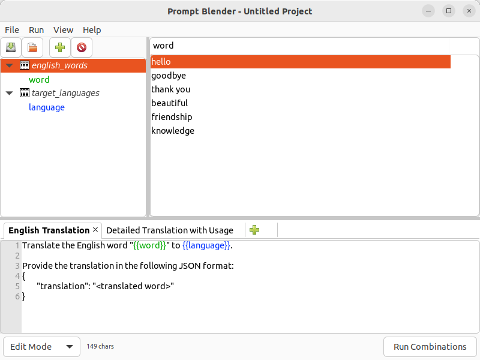
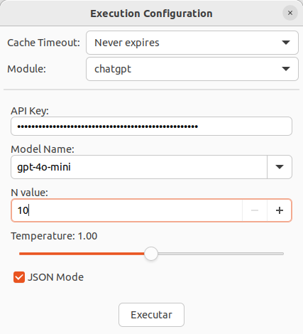

# 🤖 PromptBlender

**A no-code tool for LLM prompt testing and experimentation at scale**

[](https://pypi.org/project/prompt-blender/)
[](https://pypi.org/project/prompt-blender/)
[](https://github.com/edanssandes/prompt-blender/blob/main/LICENSE)

## 🎯 What is PromptBlender?

PromptBlender is a no-code automation tool that simplifies how you test and optimize prompts for Large Language Models (LLMs). Instead of manually testing prompt variations one by one, PromptBlender automatically generates hundreds or thousands of prompt combinations, executes them against your chosen LLM, and provides comprehensive analysis of the results.

Perfect for researchers, data scientists, prompt engineers, and anyone who needs to systematically evaluate LLM performance across different scenarios.

## ✨ Key Features

### 🎲 **Prompt Generation**
- **Template-Based Approach**: Create prompt templates with variables that get automatically filled
- **Cartesian Product Generation**: Automatically generates all possible combinations of your parameters
- **Multiple Prompt Variants**: Test different prompt formulations simultaneously

### 📊 **Flexible Data Input**
- **Multiple Formats**: Excel (xlsx, xls), CSV, JSON/JSONL, plain text, PDF, DOCX, and images
- **Directory Loading**: Bulk load data from entire directories
- **Dynamic Parameter Merging**: Combine data from multiple sources

### 🔌 **LLMs Support**
- **OpenAI GPT Models**: ChatGPT API integration with cost tracking
- **Groq Cloud**: Lightning-fast inference with Llama models
- **Gemini**: Google Gemini API integration
- **DeepSeek**: Access DeepSeek's LLMs
- **Maritaca**: Integration with Maritaca/Sabiá LLMs
- **Browser-Based Agents**: Automated web interface interaction via BrowserUse
- **Plugin System**: Easy integration with custom APIs and LLM applications

### 🔄 **Execution Management**
- **Multiple LLMs Execution**: Execute multiple LLM configurations to compare results
- **Cache System**: Avoid redundant API calls with caching
- **Batch Processing**: Optimize API usage with batching

### 📈 **Analysis & Reporting**
- **Automated Results Processing**: Built-in analysis modules for different response types
- **Cost Tracking**: Budget monitoring and spend limits
- **Export & Sharing**: Complete results packaging with historical tracking

### 🖥️ **Dual Interface Options**
- **Graphical User Interface (GUI)**: User-friendly graphical interface for interactive use
- **Command Line Interface (CLI)**: Command-line interface for automation and scripting

## 🚀 Quick Start

### Prerequisites

- **Python 3.11+** (Required)
- **LLM API Access** (OpenAI or Groq)

### 📦 Installation

#### Standard Installation
```bash
pip install prompt-blender
```

#### With Browser Automation Support
```bash
pip install "prompt-blender[browseruse]"
```

#### Current Development Version
```bash
pip install git+https://github.com/edanssandes/prompt-blender
```


### 🟢 Using Conda (Recommended)

Create an isolated environment for better dependency management:

```bash
# Create environment
conda create -n prompt-blender python=3.11

# Activate environment
conda activate prompt-blender

# Install PromptBlender
pip install prompt-blender
```

#### Linux Users

Install wxPython with conda before installing prompt-blender:
```bash
conda install wxpython
```


## 💻 Usage

### 🖥️ Graphical User Interface (GUI)

Launch the GUI for interactive prompt experimentation:

```bash
python -m prompt-blender
```

The GUI provides a complete workflow:
1. **Import Data**: Load your variables from various file formats
2. **Create Templates**: Design prompt templates with placeholders
3. **Configure LLMs**: Set up your preferred AI models
4. **Generate & Execute**: Automatically create and run all prompt combinations
5. **Analyze Results**: Review comprehensive analysis and export findings

| Main Interface | Execution Configuration |
|---|---|
|  |  |

### ⌨️ Command-Line Interface (CLI)

For automation and scripting, create a project using GUI then use CLI to automate runs:

```bash
# Run a prompt blending project
python -m prompt-blender config.pbp --run

# Merge external data
python -m prompt-blender config.pbp --run --merge "questions=new_data.csv"

# Set custom output location
python -m prompt-blender config.pbp --run --output results.zip --overwrite

# Use custom cache directory
python -m prompt-blender config.pbp --run --cache-dir /tmp/cache

# Analyze existing results
python -m prompt-blender --dump-results results.zip
```

#### CLI Options
- `--run`: Execute without GUI
- `--merge`: Merge external CSV/JSON data files
- `--output`: Specify output file location
- `--overwrite`: Overwrite existing results
- `--cache-dir`: Custom cache directory
- `--dump-results`: Analyze existing result files 


## 🛠️ Advanced Features

### Plugin System
Extend PromptBlender with custom integrations:
- **Custom LLM Providers**: Add support for new APIs
- **Analysis Modules**: Create specialized result processors
- **Data Loaders**: Support new file formats

### Batch Processing
Optimize API usage with intelligent batching:

### Result Analysis
Comprehensive analysis tools:
- **JSON Response Parsing**: Extract structured data
- **Cost Calculation**: Detailed spending reports
- **Performance Metrics**: Spreadsheets presents Response time and allow further results evaluation
- **Export Options**: Full zip export of results


## 🤝 Contributing

We welcome contributions! Here's how you can help:

1. **🐛 Report Issues**: Found a bug? Open an issue with details
2. **💡 Feature Requests**: Suggest new capabilities
3. **🔧 Pull Requests**: Submit code improvements
4. **📖 Documentation**: Help improve our docs
5. **🧪 Testing**: Add test cases and examples

### Development Setup
```bash
git clone https://github.com/edanssandes/prompt-blender
cd prompt-blender
conda create -n prompt-blender-dev python=3.11
conda activate prompt-blender-dev
```

## 📄 License

PromptBlender is released under the **MIT License**. See [LICENSE](LICENSE) for details.

⚠️ **Use at your own risk!**

## 🔗 Links

- **🏠 Homepage**: [https://github.com/edanssandes/prompt-blender](https://github.com/edanssandes/prompt-blender)
- **📦 PyPI**: [https://pypi.org/project/prompt-blender/](https://pypi.org/project/prompt-blender/)
- **🐛 Issues**: [https://github.com/edanssandes/prompt-blender/issues](https://github.com/edanssandes/prompt-blender/issues)
- **📧 Contact**: [Edans Sandes](https://github.com/edanssandes)

---

**Made with ❤️ for the AI community**
